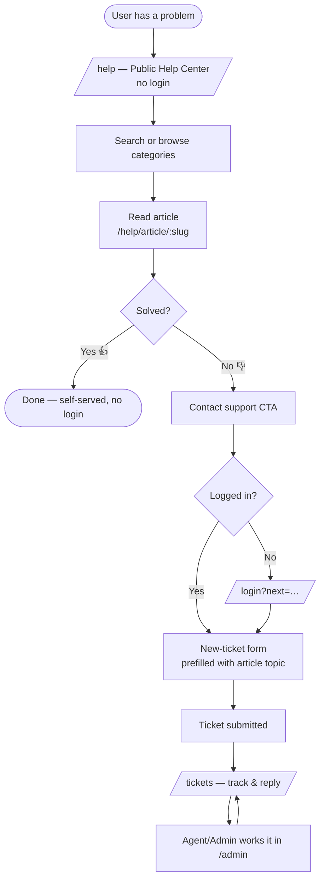

# Help Center Flow — Plan

Status: **BUILT** (frontend implemented + verified; run `npm install` in frontend/ for the new markdown deps).
in front of the existing ticketing app. Approve this before we build.

## 1. Goal & principle

A confused user should be able to **help themselves without logging in**, exactly
like `help.instagram.com`. Login is only required for account-specific actions
(raising or tracking a ticket). The design is a **deflection funnel**: most users
are answered by public articles and never sign in; only the unresolved ones cross
the login line to contact support.

## 2. Confirmed decisions

- Root `/` sends **logged-out** visitors to the public Help Center (`/help`).
  Logged-in users still go to `/tickets` (customer) or `/admin` (staff).
- "Contact support" → **log in if needed → new-ticket form pre-filled** with the
  article/topic the user came from.
- **Polished, branded** visuals in this first pass (login-page quality).

**Locked by tech lead:**
- Article bodies are **Markdown** (seeded content uses #/##, bold, lists) → render
  with react-markdown + remark-gfm + **rehype-sanitize** (staff-authored later ⇒ sanitise).
- **"Ask Ara"** on help pages is **deferred to pass 2** — the deflection funnel must
  work standalone and not depend on the AI sidecar's runtime. UI slot reserved in the
  article "Still need help?" section (Ask Ara / Contact support).

## 3. Flow

## 4. Route & auth map

| Route | Auth | Status |
|---|---|---|
| `/` | public | change: logged-out → `/help` |
| `/help` | public | NEW — landing (search, categories, popular) |
| `/help/category/[slug]` | public | NEW — articles in a category |
| `/help/article/[slug]` | public | NEW — article + helpful? + contact CTA |
| `/help/search?q=` | public | NEW — search results |
| `/login` | public | exists — add `next` return-path support |
| `/tickets` | customer | exists — add `?new=1&topic=` prefill |
| `/admin` | staff | exists — unchanged |

## 5. Backend contract (ALREADY EXISTS — no server changes)

- `GET /api/public/kb/categories` → categories that have ≥1 public article,
  each with `article_count`. (Empty categories are hidden.)
- `GET /api/public/kb/articles?category=<id>&search=<q>` → published,
  everyone-visible articles, sorted by `views` desc. `search` matches title+body.
  No params = all public articles (top of list = most-viewed = "Popular").
- `GET /api/public/kb/articles/:idOrSlug` → one article (accepts ObjectId **or
  slug**), records a view, returns `helpful_percent` + `feedback_count`. 404 if
  not found/unpublished.
- `POST /api/public/kb/articles/:idOrSlug/feedback` `{ helpful: bool, comment? }`
  → 201. Auth optional (attributed if signed in).

Seeded content available today: 5 categories (Getting Started, Your Closet,
Outfits & Ara, Account & Billing, Troubleshooting), 8 published articles.

## 6. Screen specs

### 6.1 Public layout (`/help/*`)
- Light top bar: Superbae wordmark (links `/help`) + a search field (md+) +
  a **Log in** button (→ `/login`). NO app sidebar.
- Simple footer. Brand gradient accents, Poppins/Great Vibes, same tokens.

### 6.2 `/help` landing
- Hero: "How can we help?" + large search box (Enter → `/help/search?q=`).
- Category grid: card per category (icon, name, description, `article_count`).
  Data: `GET /categories`. Card → `/help/category/[slug]`.
- "Popular articles": first ~6 from `GET /articles` (already views-sorted).
- States: loading skeletons; empty (no categories) → friendly message.

### 6.3 `/help/category/[slug]`
- Header: category name + description. List of article links.
- Data: `GET /categories` (to resolve slug→id + name) then
  `GET /articles?category=<id>`. Back link to `/help`.
- Empty → "No articles here yet."

### 6.4 `/help/article/[slug]`
- Article title, category breadcrumb, body (rendered), last-updated.
- "Was this helpful? 👍 👎" → `POST /articles/:slug/feedback`; after vote show a
  thank-you and, on 👎, surface the **Contact support** CTA prominently.
- Always-present footer CTA: "Still need help? Contact support".
- Data: `GET /articles/:slug`. 404 → "Article not found" + back to `/help`.

### 6.5 `/help/search?q=`
- Reads `q`, calls `GET /articles?search=<q>`, lists results (title + snippet +
  category). Empty → "No results — try different words" + Contact support.

## 7. The support hand-off (login → prefilled ticket)

1. "Contact support" builds a target: `/tickets?new=1&topic=<article title>`.
2. If logged out → go to `/login?next=<encoded target>`.
3. `/login` after success routes to `next` (validated: must start with `/`),
   else falls back to role default. Staff still land on `/admin`.
4. `/tickets` reads `?new=1` → opens the "New Ticket" section with the subject
   pre-filled (e.g. `Need help with: <topic>`); user edits + submits as today.

## 8. Files

New:
- `src/app/help/layout.tsx` — public shell (header/footer, no auth)
- `src/app/help/page.tsx` — landing
- `src/app/help/category/[slug]/page.tsx`
- `src/app/help/article/[slug]/page.tsx`
- `src/app/help/search/page.tsx`
- `src/components/help/*` — HelpHeader, CategoryCard, ArticleListItem, SearchBox,
  HelpfulVote, ContactSupportCTA
- `src/lib/api.ts` — add public KB calls (publicCategories, publicArticles,
  publicArticle, submitArticleFeedback) + types (KbCategory, KbArticle)

Changed:
- `src/app/page.tsx` — logged-out → `/help`
- `src/app/login/page.tsx` — honor `?next=`
- `src/app/tickets/page.tsx` — honor `?new=1&topic=`

No backend changes. No new dependencies (maybe a tiny `skeleton` UI element).

## 9. Edge cases

- KB empty / API down on a public page → graceful message, never a blank screen.
- Article slug not found → 404 view with a route back to `/help`.
- `next` param sanitised (only internal paths) to avoid open-redirects.
- A logged-in customer clicking Contact support skips `/login` and goes straight
  to the prefilled form; a staff user is sent to `/admin` (they don't file tickets).
- Feedback double-vote: disable the buttons after a vote in the session.

## 10. Build sequence

1. API client + types for public KB.
2. Public layout + `/help` landing (categories + popular + search box).
3. Article page + helpful vote + Contact CTA.
4. Category page + search results page.
5. Hand-off wiring: `next` in login, `?new=1&topic=` in tickets, root redirect.
6. Polish pass (hero, cards, spacing, empty/loading states).

## 11. Verification

- `npm run build` + typecheck green.
- Live smoke against the seeded KB: `/help` lists categories, open an article,
  submit 👍/👎, and confirm the Contact-support → login(`next`) → prefilled
  ticket path. (Needs the API + Mongo running; I can run the public read path
  against a stub, full path on your machine.)

## 12. Out of scope (future)

- An "Ask Ara" entry point on the help pages (chat with the RAG assistant before
  filing a ticket).
- Showing `helpful_percent` publicly, article view counts, related articles.
- Category icons/imagery beyond emoji.
